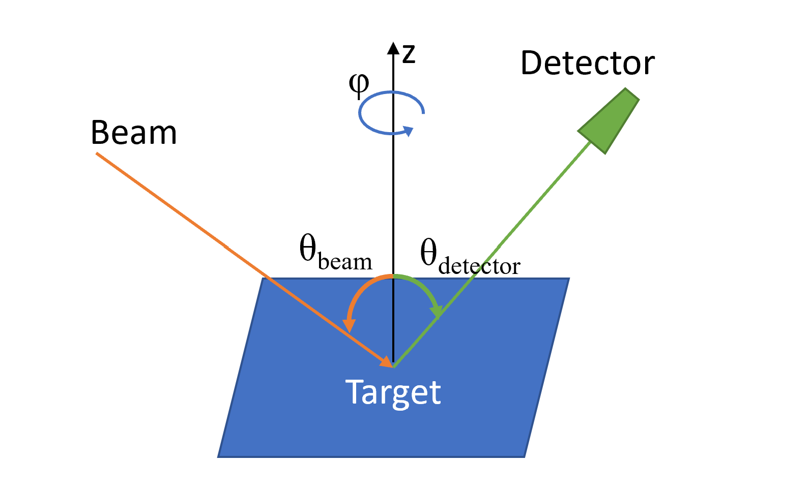
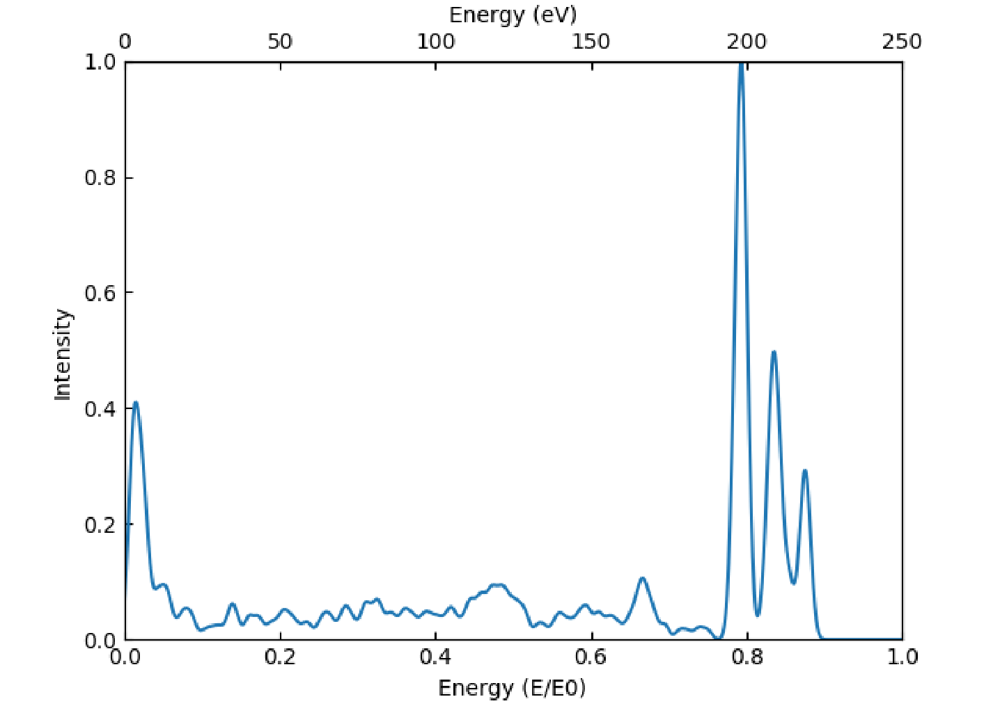
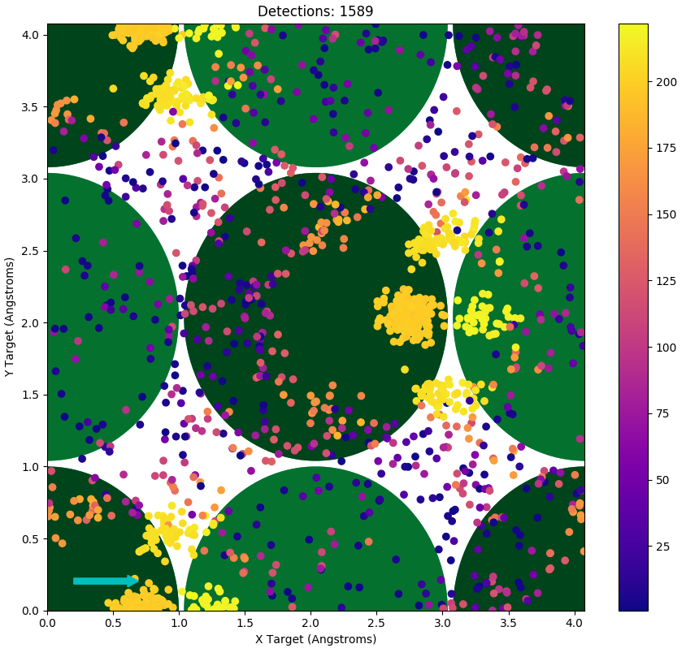
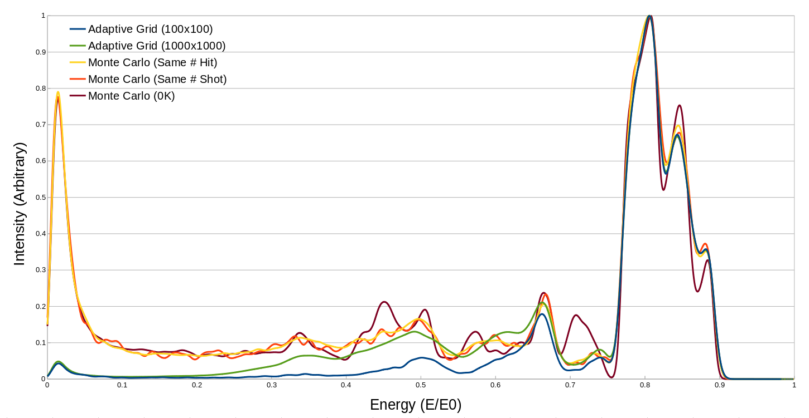
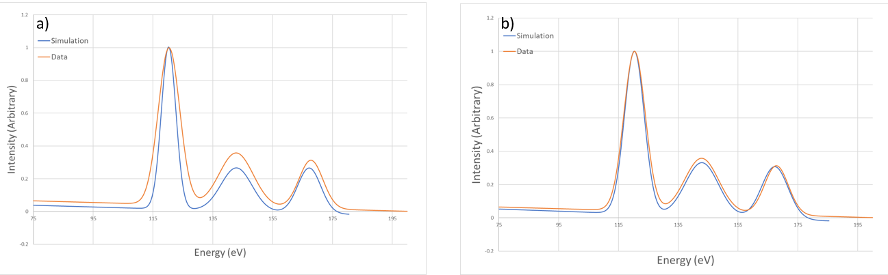

**********************
Theory behind |SAFARI|
**********************

Introduction
############

Low and hyperthermal energy ion surface collisions are of interest in a variety of scientific and industrial applications. Examples of such applications include: fusion reactor walls, EUV light sources, ion drive optics, spacecraft outer surfaces, etc, where interactions with the ions result in erosion, lowering the life time of the device. In these cases there is a wide energy distribution of the incident ions. Better understanding of collisions in this energy range can assist with developing materials which can better withstand these environments.

This page is arranged as follows: :ref:`methods` discusses the algorithms used in the code, and is arranged in the order in which the various routines are run. :ref:`methods` also includes information about the input/output files, as well as command line arguments for SAFARI. :ref:`results` discusses comparisons between different scattering modes, and then gives an example of using SAFARI to assist with analysis of experimental data.

   The scattering geometry and coordinate system used in SAFARI. The incoming  beam and detector are co-planar, specified by the angle :math:`\phi`\ , and are aligned at angles :math:`\theta_{\rm{beam}}` and :math:`\theta_{\rm{detector}}` with respect to the target surface normal (z-direction), respectively.

.. _methods:

Methods
#######

Input Files and Arguments
*************************

SAFARI is configured using a variety of input files, one primary file, and then several optional files, depending on the settings in the primary one. The primary file (referred to as the |input_file| will determine whether the other files are needed, the other optional files are the externally provided potential tables (``.pots``) and the externally provided lattice file (``.crys_in``). The units used in these files are listed in :numref:`table_units`.

.. container::

   .. table:: Units used in SAFARI, both internally and in the input files
      :name: table_units

      ============ ==============================================
      **Quantity** **Units**
      ============ ==============================================
      Energy       eV
      Distance     Å
      Mass         AMU
      Angles       Degrees
      Time         :math:`{Å}  \sqrt{\textrm{AMU / eV}}`
      Momentum     :math:`\sqrt{\textrm{eV AMU}}`
      Velocity     :math:`\sqrt{\textrm{eV / AMU}}`
      Force        eV / Å
      ============ ==============================================

The |input_file| contains the primary configurations, and is arranged with instructions in a specific order, with an assortment of instructions per line. Lines beginning in ``#``, or consisting entirely of whitespace are considered “comment lines", and are ignored. Values on a line are separated by whitespace. This file is used to specify the initial beam parameters, such as initial energy, angle and species. It is also used to specify the target location algorithm, as well as detector parameters. For auto-generated surfaces, this file is used to specify the basis and face of the target, and for external surfaces, it is used to make adjustments to the rotation of the provided surface.

.. container::

   .. table:: Command line arguments for SAFARI.
      :name: table_arguments

      +-------------------+---------------------------------------------------------+
      | **Argument**      | **Description**                                         |
      +===================+=========================================================+
      | -i [inputfile]    | Sets the primary input file to ``[inputfile].input``    |
      +-------------------+---------------------------------------------------------+
      | -o [outputfile]   | Sets the file names for the output files                |
      +-------------------+---------------------------------------------------------+
      | -t [temperaature] | Overrides the target temperature                        |
      +-------------------+---------------------------------------------------------+
      | -n [number]       | Overrides the trajectory number                         |
      +-------------------+---------------------------------------------------------+
      | -e [energy]       | Override of the initial energy                          |
      +-------------------+---------------------------------------------------------+
      | -p [filename]     | Enables using force tables from ``[filename].pots``     |
      +-------------------+---------------------------------------------------------+
      | -s                | Forces this run to be a single shot run                 |
      +-------------------+---------------------------------------------------------+
      | -x [value]        | sets the x-coordinate target of the single shot run     |
      +-------------------+---------------------------------------------------------+
      | -y [value]        | sets the y-coordinate target of the single shot run     |
      +-------------------+---------------------------------------------------------+
      | -r                | flags the single shot run to only output nearby sites   |
      +-------------------+---------------------------------------------------------+

The externally provided potentials file (``.pots``) consists of tab-delimited tables of forces and potentials. The format for each row is ``[A] [B] [V] [F]``, where A and B are the atomic symbols of the two atoms under consideration, and V and F are the potential energy and forces between them. The order in which these lines occur in the file, corresponds to the rows in the force tables, where the first line would be index 1 in the table, and corresponds to a separation distance of ``r_min``, where ``r_min`` is defined in the |input_file|. SAFARI will generate a ``.pots`` file in the output directory for the given lattice if none is provided. To produce a similar file, it can be done in a standard spreadsheet application, by generating the required tables, and then pasting them into an appropriately named text file.

Lattice and Lattice Generation
******************************

The lattice used in SAFARI consists of a collection of Site objects, which specify an atom at a particular location, with a particular momentum. These sites are arranged in Cells, where each Cell, is a 5x5x5 cube, with a volume of :math:`\textrm{125~Å}^{3}`, aligned with the global XYZ coordinate system. This is done so that the Cell for any given location can be quickly looked up in a hash map, by converting the location to an index of the position of the nearby cube. The current implementation results in a maximum lattice radius of 512 nm. Each Cell then consists of an array of Sites. The Cell size of 5x5x5 was chosen as it resulted in a minimal lookup time for nearby lattice sites. If the cells are larger, there are more sites to check in each one. If the cells are smaller, more cells require checking for sites. This cell size should be adjusted if materials of drastically different atomic densities are considered.

Generating from provided basis
~~~~~~~~~~~~~~~~~~~~~~~~~~~~~~

In the lattice section of the |input_file|, the lattice constants ax, ay, and az are defined, as well as a normalized primitive cell. This primitive cell is specified such that when tiled along x, y, and z, it will reproduce the correct unit cell for the +z face. The format for the primitive cell is ``[x] [y] [z] [index]``, where x, y, z are the normalized coordinates of the site, and index represents the atom at that site. These atoms are specified by index in the next section of the input file.

The atoms are specified with 2 lines of information per atom:

::

   [Atomic Mass] [Atomic Number] [Atomic Symbol]
   [kx] [ky] [kz]

The first line here is for defining the mass, number and symbol of the atom. The second line defines spring constants for the given site. These spring constants are used for lattice thermalization, as well as for the most basic of the lattice restoring force types, which are discussed later.

The surface direction is specified on the surface direction line of the |input_file| in the following format: ``[direction] [load-flag] [rotate-to]``, where ``[direction]`` is the target surface direction. When using the internal surface generator (``[load-flag]`` is “f"), then ``[rotate-to]`` is ignored. To produce a surface, this primitive cell is tiled into a large cube, and then rotated such that ``[direction]`` is pointing along +z, and the cube is cut to present a flat surface. The size of the generated lattice in primitive cells is also specified in the |input_file|. This cutting is done such that the algorithm which generates the top-most surface will remove entire primitive cells if any of the atoms in the cell are above z=0. The bottom face is cut via a simple culling of atoms below a specified minimum distance. This bottom surface cut is done to reduce memory allocation, and to increase the performance of the used lookup maps.

Once the surface is generated, it is output to a ``.crys`` and ``.xyz`` file. The ``.crys`` file is of the correct format for using as an externally provided surface, and the ``.xyz`` is in the standard format for use with software such as VMD :cite:`VMD`.

Generating from external file
~~~~~~~~~~~~~~~~~~~~~~~~~~~~~

To specify that the lattice is to use an external surface, ``[load-flag]`` must be set to “t" on the surface direction line of the |input_file|. ``[direction]`` and ``[rotate-to]`` will then specify the given and expected directions of the provided lattice. If these are both the same, no further processing is done after loading, otherwise the provided surface will be rotated accordingly.

To load the lattice from an external file, the first step is to produce the ``.crys_in`` file, which should be named the same as the |input_file| for this run. The format for this file is lines of ``[X] [Y] [Z] [Atomic Number] [Mass]``, where X, Y and Z are in Å, and mass in AMU. The atom at that site is looked up by the value given for ``[Atomic Number]``.

After loading the external surface, and rotating to the desired direction, this is also output the same format of ``.crys`` and ``.xyz`` files as in the built-in generation mode.

Surface Thermalization
**********************

The surface thermalization in SAFARI is treated as an isotropic, Gaussian distribution in initial positions and momenta of the surface sites. For a non-zero temperature, an average displacement and momentum is calculated as follows:

.. math::
   
   \begin{split}
   dr_i = \sqrt{2E/k_i} \\
   dp_i = \sqrt{2mE}
   \end{split}

Where E is the average kinetic energy associated with the given temperature, and :math:`k_i` is the spring constant for the given direction. For thermalizing a site in the lattice, two random numbers (:math:`r_1` and :math:`r_2`) are chosen from a uniform range of [0, 1). These are chosen from a seeded random number generator, where the seed is a combination of a seed from the input file, the thermal seed of the ion (usually just the ordinal of the ion in the set of runs), and the index of the site in the lattice. This allows replicating the exact thermalization state of the lattice for a later run. :math:`r_1` is then set to :math:`\sqrt{-ln(r_1)}`.

The position and momentum of this particular site is then set to:

.. math::
   
   \begin{split}
   r_i = r_0 + dr_i r_1\cos(2\pi r_2) \\
   p_i = p_0 + dp_i r_1\sin(2\pi r_2)
   \end{split}

.. _target_select:

Target Location Selection
*************************

SAFARI includes several different modes for selecting the locations on the surface for scattering: Single Shot, Monte Carlo, Grid, Chain and Adaptive Grid. Of these, the primary ones used are Single Shot, Monte Carlo and Adaptive Grid. With the exception of Single Shot, the rest of the modes all use an identical algorithm per particle fired, and only differ in how the target location on the surface is selected.

Single Shot mode will fire a single ion at the given target coordinates, and will output an entire log of the trajectory. Two log files are produced for this, a ``.traj`` file, which is a table of position, momentum and energy states of the ion itself, for each timestep in the trajectory, and a ``.xyz`` file, which also includes the positions of relevant lattice sites. These file outputs are the only difference between a trajectory run in Single Shot and the rest of the modes.

Monte Carlo mode will randomly select a valid surface location, and then fire the particle at that, if temperature is not 0, each ion fired will see a different thermalized surface.

Grid mode involves rastering the target coordinates across the surface in a rectilinear grid. The bounds and step sizes for this grid are defined in the |input_file|. This mode can be used to assist with determining an initial grid size for the Adaptive Grid mode, which is discussed below.

Chain mode results in a line of trajectories starting at the given lower bound, and ending at the upper bound. The number of particles fired for this mode uses the same option as the number of particles used in Monte Carlo mode.

Adaptive Grid mode starts by rastering a relatively coarse, fixed spacing grid over the surface. This spacing is specified in the |input_file| as for the Grid mode. For each fired particle which ends up in the detector (See :ref:`detector_info`), a finer grid is produced around the impact point, and more particles are fired at the new grid. This bifurcation occurs up to a number of times specified in the input file. If the temperature is not 0, this is then repeated for a given number of thermal iterations, where each ion fired during the grid iteration will see a surface with the same initial thermalization state.

Trajectory Algorithm
********************

Each trajectory run starts with an initial setup of the ion’s kinetic energy, as well as initial momentum/position. The momentum is first set based on the specified initial energy and incident angles of theta and phi. The x and y positions are then set such that at z=0, the particle would be at the specified location, if there were no forces acting, and the particle is positioned initially at z=z0. The value z0 is specified in the |input_file|. If an image force is enabled, the z-momentum of the ion is then adjusted accordingly. The ion is then passed to the main integrator for the trajectory run.

Finding nearest atoms to ion
~~~~~~~~~~~~~~~~~~~~~~~~~~~~

For the first step of the trajectory run, the sites near the ion are collected and sorted by distance, and if inter-lattice forces are enabled, each site has a similar list of sites collected. This collection and sorting is only done afterwards if the ion or site has moved sufficiently that the ordering of the start of the list might have changed. When this list is initially collected, the sites in the lattice have their positions adjusted based on the thermalization state for this particular trajectory. If the site for that cell had been interacted with by a previous ion, it will be reset to its initial location.

Error Checks and Thresholds
~~~~~~~~~~~~~~~~~~~~~~~~~~~

The ion is then checked to see if it is still in a valid state. The following are the exit conditions checked: |buried|, |off edge|, |stuck|, |froze| or left, If this check fails, the run is terminated.

As SAFARI is designed for surface scattering spectra, the simulation doesn’t focus on trajectories which get too deep into the surface. These trajectories tend to not leave at appreciable energies, and generally do so in a random manner, not conducive to analysing spectra. These are flagged as |buried|, and this distance can be adjusted in the |input_file|.

Since the generated crystal is of finite size, there is a concern of boundary conditions along the global x and y directions. As a result, any trajectory which gets too close to these boundaries is terminated and flagged as |off edge|. If this occurs a significant number of times in a run, the radius of the generated crystal should be increased, which is done in the |input_file|.

There are cases where the Ion can get stuck in the lattice. This is treated as two different exit conditions, |stuck| and |froze|. |stuck| is triggered if the total energy of the ion drops below a specified amount, this will generally indicate that the ion is in a bound state in the lattice, and will not be detectable. |froze| is triggered if the number of integration steps has exceeded a specified number. Both of these conditions are defined in the |input_file|.

If the ion’s global z-coordinate has exceeded z0, then the ion is considered as having left the lattice, this being the only “good" exit condition.

There is an additional check for detecting if the ion has encountered an error in the energy due to issues related to lattice particles entering or leaving the simulation, the threshold for this can also be defined in the |input_file|.

Equations of Motion
~~~~~~~~~~~~~~~~~~~

At each integration step, the forces on the ion and lattice are calculated twice, once for the current location to compute a predicted location, and once at the predicted location. This is used for a position based predictor-corrector algorithm. The forces considered are, Lattice-Ion pair potentials, Inter-Lattice potentials, Image forces on the ion and electronic friction on the ion.

For each lattice site found within interaction distance of the ion, the pair potentials are computed (via lookup table generated during loading of input files, and linear interpolation). These forces are then applied to the ion-site pair. Both the maximum distance and number of pairs considered are specified in the |input_file|.

The lattice sites then have their forces computed, with several options available: Einstein Springs, Lattice Springs and Pair Potentials. In the case of Einstein Springs, the lattice sites are assumed to be connected to their original locations with simple, Hooke’s law springs, so no other sites are needed to be considered. For Lattice Springs the potentials used are simple springs between the site and the nearest neighbours for the T=0, rest case of the lattice, and for Pair Potentials the same consideration is done for each nearby lattice site as for the ion-lattice interactions.

For the initial pass, the predicted locations of the ion and lattice sites are then computed, and for the second pass, the maximum integration error is computed. The error in position is :math:`dr_i = 0.25dt^2(F_{t,i} - F_i) / mass`, where :math:`F_{t,i}` is the force at the predicted location, and :math:`F` is the force at the current location, :math:`dr` the error in position, and :math:`dt` the current time step. The maximum value for this is what is then used for adjusting the timestep.

If the error is sufficiently small for the run, the criteria of which depend on the timestep adjustment, discussed in Section :ref:`timesteps`, the site’s position and momentum are updated, where the position is set to the predicted location, corrected by :math:`dr_i`, the momentum is set to the average momentum between the current and predicted locations.

.. _timesteps:

Time Step Adjustments
~~~~~~~~~~~~~~~~~~~~~

After the two force calculations are run, and the maximum position error is calculated, the timestep for the integration is considered for updating. If there is no positional error, the timestep is doubled, up to a set maximum, otherwise the timestep is adjusted based on the computed error. A change in the timestep is computed as :math:`{({scale}/{error})}^{exponent}`, where scale and exponent can be adjusted in the |input_file|, the defaults being a scale of :math:`10^{-6}`\ Å, and exponent of 0.3. If the resulting change reduces the timestep by more than a factor of 5, then the timestep is adjusted and the force calculations are re-done for the new timestep, without updating the positions, otherwise, the timestep is updated after the positional updates. This timestep can be reduced down to a minimum specified in the |input_file|.

.. _detector_info:

Logging Valid Hits
~~~~~~~~~~~~~~~~~~

After the run has terminated for one of the various exit conditions, the ion will be considered for logging. If logging errored particles is enabled in the |input_file|, then the ion will be logged regardless of validity, however the energy will be set to the associated error flag. The ``.dbug`` file has a key as to which energy corresponds to which error flag. An additional error condition is checked here, for whether the ion is |trapped|. This can occur if it left the surface, but without sufficient upwards momentum to overcome the image force, and will be deposited on the surface afterwards. If the ion has left the surface, is in the detector window, or is configured to record regardless, then it will be logged to the |data_file|.

Output Files
************

SAFARI outputs the run information in a variety of text files. The main two output files are the |data_file| and the ``.dbug`` file. If the ``-o`` argument is not present, then these will be named, and in the same directory as the input files, otherwise they will use the value passed in with ``-o``.

The ``.dbug`` file will contain information about the configuration of the run, as well as a summery of some general statistics for the error conditions. This is to be used to determine if the lattice size or other error conditions needs to be adjusted, as if a significant number are listed as |froze|, then it might merit an increase in maximum integration steps, and if a significant number are listed as |off edge|, then the size of the lattice should be increased. The ``.dbug`` file also includes a trimmed copy of the input file used to start the run, as well as notifications of any overrides via command line arguments.

The |data_file| is the primary output of detections for the run. This is a tab-delimited file, with the first line being a header to indicate what each column represents. The file format is as follows:

``[X0]`` ``[Y0]`` ``[Zmin]`` ``[E]`` ``[THETA]`` ``[PHI]``
``[ion index]`` ``[weight]`` ``[max near]`` ``[min dist]`` ``[steps]``
``[Max Error]`` ``[total time]``

X0 and Y0 are the initial target locations for the ion (prior to image charge corrections, etc), Zmin is the smallest value of Z for the ion during its trajectory. E, THETA and PHI are the final conditions of the ion, where E is the kinetic energy, THETA and PHI are the outgoing angles (:math:`\theta_{\rm{detector}}` and :math:`\phi` in :numref:`fig_geom`). The rest of the values are for use for replicating specific runs, or for debugging purposes, for example, ``[steps]`` can be used to determine a good number for the maximum number of integration steps for a particular input configuration.

Additional output files are the ``.pots`` and ``.crys`` files, which can be used for externally provided surfaces, and for providing the potential tables for a later run. There is also a ``.crys.xyz`` file generated. This is a standard .xyz file representation of the lattice, for use in external visualizers.

During a single shot run, an additional two files are generated, a ``.traj`` file, and a ``.xyz`` file. The ``.traj`` file contains the time, position, momentum and energy of the ion at each timestep, as well as some additional information such as number of lattice sites under consideration, and positional error from the integrator at that step. This file is useful for plotting the specific trajectory of the ion, as well as determining the effecitve number of “single impacts” for the trajectory. The ``.xyz`` file contains a log of the positions and momenta of the ion and each lattice site considered. If the ``-r`` argument is present, this will only include lattice site which are nearby the ion, otherwise it will include the entire lattice. This restriction allows for smaller total visualizations, as these files can get prohibitively large for a few thousand time steps.

Output File Analysis
********************

There are three main analysis methods used on the |data_file|, for
generating Intensity vs Energy plots, Impact Parameter plots and Energy vs Theta plots. This is done via an assortment of Python scripts, for parsing the file, and then generating the plots. The first step in this process is to define a detector window for the analysis. This window includes spatial bounds (defined by the two outgoing angles) and an energy range (usually bounded by a specific minimum energy). Next the |data_file| is read, and the lines are parsed for the energy, theta and phi coordinates of the outgoing trajectory. If these fit within the window of the selected detector, then the line is added to a list of detections. Once this list is populated, it is then processed to generate the desired plot.

Intensity vs Energy plotting
~~~~~~~~~~~~~~~~~~~~~~~~~~~~

For the intensity vs energy plotting, the detector is assigned a particular width for the reported energies, which represents the uncertainty in the reported energy of the detector. For each line in the list of detections, a Gaussian distribution is generated centered on the energy for that line, with minimum and maximum bounds being the lower and upper detector bounds. The width of this Gaussian is the detector width. All of the resulting Gaussian distributions are then summed and then normalized to generate the plot. A text file containing the final table is produced, along with information on the number of total Gaussian distributions summed. A sample such plot is shown in :numref:`fig_sample_i_vs_e`.

   This is a sample Intensity vs Energy plot, it contains 1589 total detections.

Impact Plot Analysis
~~~~~~~~~~~~~~~~~~~~

Impact plots are generated using the same parameters as the intensity vs energy plots, without a consideration of the energy width of the detector. A sample such plot is shown in :numref:`fig_sample_impact_plot`. The impact plot is interactive, each point can be clicked on to get the specific energy and location, and via double clicking or shift clicking, various single shot runs can be done to replicate that particular point. This will generate the ``.xyz`` for the trajectory, and then run a smoothing algorithm on the file, to result in a consistent time step. VMD :cite:`VMD` will then be opened to display the resulting trajectory.

   This is a sample Impact Plot. It corresponds to the Intensity vs Energy plot in :numref:`fig_sample_i_vs_e`. The cyan arrow indicates the direction of the incoming beam and the large green circles represent the locations of the atom in the lattice, the darker circles are the top most layer. The colour bar indicates the outgoing energy of the projectiles represented in the plot.

Energy vs Theta plotting
~~~~~~~~~~~~~~~~~~~~~~~~

For the energy vs theta plots, the detector window is usually widened to include all values of theta under consideration. These plots are done by first splitting the range of energies and angles into 1024 bins each, for a matrix of :math:`1024^2` total bins, and then integrating all detections into those bins. If there are no significant bins as a result, the bins are made twice as large on each axis. This is repeated until there is a significant number of detections in a bin. This final matrix is plotted as an image, as shown in :numref:`fig_sample_e_vs_theta`. This image can then be further processed for generating intensity vs energy plots for each angle, for easier comparison with specific sets of data.

.. figure:: ../../_images/safari/sample_e_vs_theta.png
   :alt: Energy vs Theta
   :name: fig_sample_e_vs_theta
   :width: 100.0%

   This is a sample Energy vs Theta Plot, the title includes the number of detections, as well as the final grid size for this matrix, in this case, only 1 resizing if the bins was required, for a final bin count of 512.

.. _results:

Results
#######

To verify the scattering algorithms used by SAFARI, the produced spectra were compared between the different scattering modes, and comparisons were done between simulated and experimental spectra. The comparisons with experimental data were used to choose some of the parameters for the simulation, such as error thresholds.

Comparison between Adaptive Grid and Monte Carlo
************************************************

The Monte Carlo and Adaptive Grid target selection algorithms are both able to replicate the primary features in experimental scattering of Alkali metals on Cu 001 surfaces, however they have differences in runtimes, and reliability replicating certain minor features.

To compare these two scattering modes, several similar simulations were run. This was done to compare simulations with the same runtimes, trajectory counts, and detection counts. For these simulations, the surface was Au (001), and the projectiles were Na\ :sup:`+`, with an energy of 250eV, incident at 45 degrees along the :math:`<100>` direction, the surface temperature was set to 300K. For this comparison, two Adaptive Grid and Monte Carlo configurations were used. For all cases, the target detector was a stripe of :math:`\theta` from 0\ |deg|\  to 90\ |deg|\ , and :math:`\phi` in the range of -15\ |deg|\  to 15\ |deg|\ . The maximum number of integration steps was set to 4000, and the crystal size was set to 5x5 primitive cells. Image charge effects were neglected, and the surface used the basic Einstein springs for cohesion.

.. container::  
  
  .. table:: Simulation Statistics
    :name: table_sim_stats

    +-----+------------------------+------------------------+-------------+------------+-----------------------------+---------+
    |     | **Number**             | **Runtime**            | **|buried|**| **|froze|**| **|off edge|**              | **Hits**|
    +=====+========================+========================+=============+============+=============================+=========+
    | AG1 | :math:`2.13\times 10^6`| :math:`4.11\times 10^3`| 0.104       | 0.0826     | :math:`7.20\times 10^{-4}`  | 0.498   |
    +-----+------------------------+------------------------+-------------+------------+-----------------------------+---------+
    | AG2 | :math:`2.27\times 10^8`| :math:`3.80\times 10^5`| 0.0948      | 0.0755     | :math:`6.68\times 10^{-4}`  | 0.550   |
    +-----+------------------------+------------------------+-------------+------------+-----------------------------+---------+
    | MC1 | :math:`2.13\times 10^6`| :math:`5.73\times 10^3`| 0.2013      | 0.1626     | :math:`1.29\times 10^{-3}`  | 0.0230  |
    +-----+------------------------+------------------------+-------------+------------+-----------------------------+---------+
    | MC2 | :math:`4.61\times 10^7`| :math:`1.12\times 10^5`| 0.2012      | 0.1624     | :math:`1.32\times 10^{-3}`  | 0.0229  |
    +-----+------------------------+------------------------+-------------+------------+-----------------------------+---------+
    | MC3 | :math:`4.61\times 10^7`| :math:`8.37\times 10^4`| 0.1773      | 0.1809     | :math:`1.19\times 10^{-3}`  | 0.0227  |
    +-----+------------------------+------------------------+-------------+------------+-----------------------------+---------+

  Summary of statistics for the various sample runs. Number is how many projectiles were fired. Runtime is in CPU Seconds. |buried|, |froze|, |off edge| and Hits are in fractions of the total Number of projectiles, Hits is how many were in the Detector. MC refers to the Monte Carlo runs, and AG refers to the Adaptive Grid runs.

In the first adaptive grid run (AG1 in :numref:`table_sim_stats`), the initial grid was set to a 100x100 grid, over the first unit cell of the surface, this was allowed to bifurcate twice for each successful hit, and there were 100 thermal iterations. This run is the “Adaptive Grid (100x100)” in :numref:`fig_mcvsag`. The first Monte Carlo run (MC1 in :numref:`table_sim_stats`) was done with a similar number of projectiles. This run is the “Same # Shot” in :numref:`fig_mcvsag`. The second Monte Carlo run (MC2 in :numref:`table_sim_stats`) was done to result in a similar number of total detectable particles. This run is the “Same # Hit” in :numref:`fig_mcvsag`. The second Adaptive Grid run (AG1 in :numref:`table_sim_stats`), was done at a higher initial grid resolution of 1000x1000. This run is the “Adaptive Grid (1000x1000)” in :numref:`fig_mcvsag`. Finally, a 0K Monte Carlo run was done, using the same configuration as MC2, this run is MC3 in :numref:`table_sim_stats`, and is “0K” in :numref:`fig_mcvsag`. A summary of the statistics for these runs can be found in :numref:`table_sim_stats`.

Comparing the first two runs, there is a noticeable difference between efficiencies of Adaptive Grid and Monte Carlo when it comes to getting particles into the detector, for the same number of incident particles, the Adaptive Grid resulted in a 21 fold increase in detectable particles, and took about 70% of the time to do so. The reduction in runtime is mostly due to the decreased number of particles flagged as |buried| and |froze|, as these cases usually spend a while with the particle rattling around inside the lattice, not really going anywhere.

Comparing the results of the second two runs to the first, as is done in :numref:`fig_mcvsag`, shows that the simulations all agree on the primary spectral features, however there is disagreement in the lower probability/energy trajectories from the Adaptive Grid runs. Both Monte Carlo simulations result in the same behaviour, with the larger one being generally less noisy in the lower probability areas. The finer Adaptive Grid run does match some of the lower probability areas more closely to the Monte Carlo, however still entirely misses the large low energy peak. Impact plot analysis of the Monte Carlo runs indicates that these low energy trajectories are randomly positioned on the surface, and are ones which rattle around in the surface for a while before escaping at very low energies in a somewhat random direction. Since Adaptive Grid works by focusing on areas of the surface which are correlated with higher chances of trajectories resulting in a detection, it is unable to properly account for these randomly located impacts. These randomly distributed, low energy impacts can be seen as the purple areas in :numref:`fig_mcvsag_imps`.

   Intensity vs Energy plots for a 15 wide detector, positioned at :math:`\theta = 45^{\circ}`

Further analysis was done on this low energy structure, and it was compared across a range of outgoing angles, this is shown in :numref:`fig_LowEnergyPeaksThetas`. This shows a similar distribution to that of sputtered particles :cite:`okutani1980angular`, which indicates that these are trajectories which have lost memory of their initial conditions, and further explains why the Adaptive Grid was unable to properly replicate this structure.

.. figure:: ../../_images/safari/fig_MCvsAG_imps.png
   :alt: Monte Carlo vs Adaptive Grid Impacts
   :name: fig_mcvsag_imps
   :width: 100.0%

   A Comparison of impact plots for Mone Carlo (a) vs Adaptive Grid (b)

.. figure:: ../../_images/safari/low_energy_peak_i_vs_theta.png
   :alt: Low Energy Peaks
   :name: fig_LowEnergyPeaksThetas
   :width: 100.0%

   Plots of the outgoing intensity of the low energy peak, with respect to the outgoing angle, and the cosine of that angle.

Simulation vs Data
******************

SAFARI is intended for assisting with analysis of scattered spectra, and as such, was compared to an assortment of experimental data. Here we will present two comparisons, one being Energy vs Theta plots compared with the data published by DiRubio et al :cite:`cooper_prb_old_safari`, and the other comparing Intensity vs Energy plots with the Na on Cu data shown in our previous paper :cite:`new_safari`.

.. figure:: ../../_images/safari/fig_img_vs_noimg.png
   :alt: Img vs No Img
   :name: fig_img_vs_noimg
   :width: 100.0%
   
   An example of adjusting the Image charge parameters to match the experimental results.

To verify whether the image charge effects were properly accounted for, we compared the results of SAFARI with the data presented by DiRubio et al :cite:`cooper_prb_old_safari`. The data was for hyperthermal :math:`Na^+` scattered from Cu(001), with an incident angle of 45\ |deg|\ , and the sample was cooled to between 121 and 141K. :numref:`fig_img_vs_noimg`\ (a) and (b) show the results of comparing 0K SAFARI runs with the data. The main parts of the loops shown are not strongly temperature dependant, so the 0K runs can be used to adjust the image parameters. :numref:`fig_img_vs_noimg`\ (c) shows the results at 123K, which matches the temperature dependant behaviour at higher outgoing angles.

   
   An example of adjusting the analysis energy widths

Once the image parameters have been determined via the energy vs theta plotting, then the intensity vs energy plots can be used to replicate the spectra from the experimental data. An example of this process is shown in :numref:`fig_esa_fitting`. In this example, the experimental data was collected from a 254.6 eV beam of :math:`Na^+`, incident on a Cu(001) surface, at 45\ |deg|\ . The surface in this case was at a temperature of approximately 340K, and the beam had a Gaussian profile with a standard deviation of 2.0eV. :numref:`fig_esa_fitting`\ (a) shows the result of comparing simulation data with the same Gaussian binning width as the data, and :numref:`fig_esa_fitting`\ (b) shows using a 5eV width instead. The simulation uses a mono-energetic beam, whereas the actual experiment has a beam with a Gaussian profile. This results in requiring a larger binning of the simulated spectra to replicate the experimental peak widths and heights.

.. include:: ../../.shared.rst

.. |input_file| replace:: :ref:`input file<main_input>`

.. |data_file| replace:: :ref:`data file<data_file>`

.. |froze| replace:: froze

.. |buried| replace:: buried

.. |off edge| replace:: off edge

.. |stuck| replace:: stuck

.. |trapped| replace:: trapped
