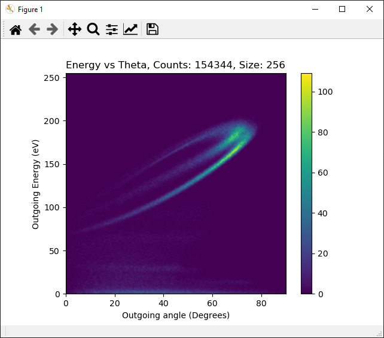

.. _safari-analysis:

************************
|SAFARI| Output Analysis
************************

The standard way to analyse the ouput of |SAFARI| is via the python analysis scripts located in the |SAFARI Github|_. These are not strictly nessisary, and you may use whatever other analysis tools you want, however this page will discuss the provided tools.

Basic Analysis
##############

This requires the following python scrips from the |SAFARI Github|_:

    -   ``safari_input.py`` - This parses the input (or dbug) file, and allows producing modified input files
    -   ``detect_processor.py`` - This is the main code for producing plots, etc
    -   ``detect_impact.py`` - This executes a single shot |SAFARI| run, and opens it up in VMD\ :cite:`VMD`
    -   ``detect_gui.py`` - This is what you will run to analyse the runs

Required Python Libraries:

    -   PyQt5
    -   matplotlib
    -   numpy

External Software required:

    -   VMD for visualizing the single shot runs
    -   Sea-Safari - The executable for |SAFARI| should be placed along with the ``detect_impact.py``
    -   XYZ - The source for this is included in the main C++ source for |SAFARI|, it is also built via the instructions in :ref:`safari-build`

The executables ``Sea-Safari`` and ``XYZ`` must be present in the run directory for ``detect_impact.py``, or manually added to path otherwise, this is not done by default via the instructions in :ref:`safari-build`.

Data Directory Structure
------------------------

``detect_gui`` will scan the local directory tree for .input and .dbug files. any found will be listed in the ``input file name`` dropdown menu. Selecting one and clicking ``Spectrum`` will bring up another window for that particular file, where you can then select the detector type, detector settings, and start producing plots.

.. figure:: ../../_images/detect_gui/detect_main.png
   :alt: Detect Gui
   :name: detect_main
   :width: 400
   
   The initial window from ``detect_gui``

Detector Settings
-----------------

.. figure:: ../../_images/detect_gui/detect_spectrum.png
   :alt: Detect Main Screen
   :name: detect_spectrum
   :width: 600
   
   The Spectrum window from ``detect_gui``

Data Filtering is done via the input fields directly below the detector type selection apply general filtering to the data, the fields are as follows:

    -   ``emin`` - This is the lower bound of kinetic energies of projectiles to allow in the detector
    -   ``emax`` - this is the corresponding upper bound
    -   ``eres`` - This is the effective detector width, this is used to apply a Gaussian spread to each detected energy, this is the standard deviation of each of those Gaussians
    -   ``thmin`` - Minimum value of Theta to allow for the detections, this can be further restricted by the detector specific settings
    -   ``thmax`` - corresponding upper limit for Theta
    -   ``phmin`` - Minimum value of Phi for detections, also can be further restricted by the detector settings
    -   ``phmax`` - corresponding upper limit for detector resolution
    -   ``ares`` - mostly deprecated in favour of the detector specific ``resolution`` setting

The type of detector is selected via the dropdown menu on the top left of the window, the default type being ``Spot``. The settings can then be adjusted by clicking on the ``Detector Settings`` button.

.. figure:: ../../_images/detect_gui/detect_settings.png
   :alt: Detect Main Screen
   :name: detect_settings
   :width: 240
   
   The detector settings window from ``detect_gui``

Detector Types:

    -   ``Spot`` - This is location in space, centred on ``theta``, ``phi``, with a width of ``resolution``
    -   ``Stripe`` - Not implemented yet

.. _i_vs_e_plots:

I vs Energy Plots
-----------------

This will plot Intensity vs Energy for every particle which entered the detector. These plots are comparable to the ones produced by ESA or TOF intensity vs energy plots in comparable experimental setups, and are one of the primary sets of plots for initial data comparisons. These plots are what are generally used for confirming validity of the pair potentials used.

.. figure:: ../../_images/detect_gui/detect_i_vs_e.png
   :alt: Intensity vs Energy
   :name: detect_i_vs_e
   :width: 600
   
   Sample I vs Energy Plot

This plot is saved to the same directory as the data as a ``png`` file, with name of ``<inputname>_spectrum_Energy_<emin>-<emax>_<res>``, where ``<res>`` is ``eres/E0``. There is also a ``.txt`` file made of the same name, which contains the data used to generate the plot. This text file also contains the number of detections, as well as a kinematic factor for single scattering. The x-axis for the data in the text file ranges from 0-1, and represents the range from ``0`` to ``E0``.

Notes on fitting widths
^^^^^^^^^^^^^^^^^^^^^^^

|SAFARI| uses an initial ion beam with uniform energy and incoming angles. This differs from the experimental setup, which generally has a Gaussian distribution in the initial energy, and a small angular spread in the initial angles. This can be somewhat replicated in the analysis by increasing the angular or energy width of the detector.

It can be helpful to fit the produced plot to a small number of Gaussians, based on the number of expected main trajectories contributing to the data. If the data is then also fit to the same number, the parameters for the sets of Gaussians produced can then be used to compare the simulated spectra to the experimental data.

I vs Theta Plots
----------------

This will plot Intensity vs Theta for every particle which entered the detector. This can be useful for deciding which angles to use for the detector position.

.. figure:: ../../_images/detect_gui/detect_i_vs_t.png
   :alt: Intensity vs Theta
   :name: detect_i_vs_t
   :width: 600
   
   Sample I vs Theta Plot

This plot is saved to the same directory as the data as a ``png`` file, with name of ``<inputname>_spectrum_Theta_<thmin>-<thmax>_<res>``, where ``<res>`` is the width of the detector. There is also a ``.txt`` file made of the same name, which contains the data used to generate the plot. The first line of this file contains the number of particles involved in the plot. The x-axis for the data in the text file ranges from ``thmin`` to ``thmax``.

E vs Theta Plots
----------------

This produces an image of Energy vs Theta for the particles which have impacted the detector. For generating these plots, it is generally advised to set the detector width to cover the full range of angles needed, and then use the ``phmin`` and ``phmax`` values to restrict the plane of the detections. These plots can be used to tune the image charge settings for the runs.

   
   Sample E vs Theta Plot

The image from this plot gets saved to the same directory as the data as a ``png`` file, with name of ``<inputname>_spectrum_ETheta_<emin>eV-<emax>eV_<thmin>-<thmax>_<phmin>-<phmax>_<size>``, where ``<size>`` is the number of bins (pixels) used for the plot. The image is flipped vertically with respect to the plot shown.

Notes on image charge tuning
^^^^^^^^^^^^^^^^^^^^^^^^^^^^

These plots can be used to tune the image charge for the system. This is done via the following steps:

1.  Produce a similar plot from experimental data, generally from a collection of :ref:`i_vs_e_plots`
2.  Plot the experimental data over the E vs Theta Plot
3.  If it significantly differs, adjust the image potentials, and re-run the simulations, larger image potentials tend to result in lower energies at higher angles
4.  Repeat steps 2-3 until the agreement is acceptable

Theta vs Phi Plots
------------------

We don't really use these much, but they can look nice.

   
   Sample Theta vs Phi Plot

Impact Plots
------------

These are the primary tools used for determining specific details as to which trajectories are involved with specific regions of the surface. There is a variant with is overlayed on the lattice (``Impact Plot``), and a variant without that background (``Impact Plot No Basis``), Here we will discuss the former.

.. figure:: ../../_images/detect_gui/detect_impact.png
   :alt: Impact Plot
   :name: detect_impact
   :width: 600
   
   Sample Impact Plot

The plot has 2 coloured scale bars, a mostly green one, and then a multi-coloured one. The green bar (starting at 0 at the top, and going negative) represents the colouring for the crystal used. It has circles which represent the approximate location of the atoms in the crystal used in the scattering, and the colouring represents the z-position of that atom. The multi-coloured scale represents the outgoing energy of the detected trajectories.

The positions of the particle on the plot are the initial target coordinates for the projectile, which are what are required for a single shot run to replicate the trajectory. There is a cyan arrow in one corner (specific corner depends on the direction the arrow needs to point) which indicates the horizontal projection of the initial momentum of the projectile.

Clicking on a point will mark it as selected, and the coordinates, final energy, and relative final energy will be displayed above the plot. Double left clicking the point will schedule a :ref:`single-shot <single_shot_mode>` |SAFARI| run at that location, which will then be smoothed via XYZ, and then displayed in VMD, This may take a while to run depending on the specific trajectory, as converting the timesteps to be uniform for visualization can take some time. 

If you double right click instead, then it will colour the particles in VMD such that the nearby (interacting) atoms to the projectile will appear differently from the passive, non-interacting surface atoms. 

If you shift-right click the atom, it will colour the sites such that any with more than 0.05eV of kinetic energy are highlighted.

.. |SAFARI Github| replace:: |SAFARI| Github
.. _SAFARI Github: https://github.com/SINS-Lab/SAFARI-ANALYSIS

.. include:: ../../.shared.rst